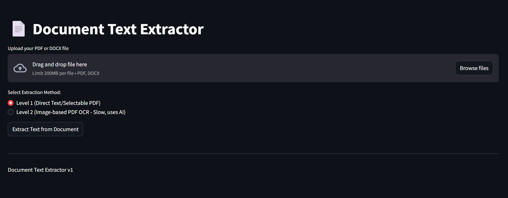

# PDF Text Extractor

A streamlit-based application for extracting text from PDF and DOCX files with multiple extraction methods.



## Features

- **PDF Text Extraction**: Extract text from PDF files using two methods:
  - **Level 1**: Direct extraction of selectable/embedded text
  - **Level 2**: AI-powered OCR for image-based PDFs using Google's Gemini API
- **DOCX Text Extraction**: Extract text from Microsoft Word documents
- **Interactive UI**: User-friendly interface with file previews
- **Progress Tracking**: Real-time status updates during extraction
- **Download Results**: Save extracted text as .txt files

## Requirements

- streamlit
- langchain
- langchain-community
- pypdf
- PyMuPDF
- google-generativeai
- python-dotenv
- pillow
- python-docx

## Installation

1. Clone this repository:
   ```
   git clone https://github.com/HARIOM-JHA01/pdftextextractor-app
   cd pdftextextractor-app
   ```

2. Install required packages:
   ```
   pip install -r requirements.txt
   ```

3. Create a `.env` file in the root directory with your Google Gemini API key:
   ```
   GEMINI_API_KEY=your_gemini_api_key_here
   ```

## Usage

1. Start the application:
   ```
   streamlit run app.py
   ```

2. Open the application in your web browser (http://localhost:8501)

3. Upload a PDF or DOCX file

4. Select the extraction method:
   - Level 1 (Direct Text/Selectable PDF): Fast, works with documents containing selectable text
   - Level 2 (Image-based PDF OCR): Uses AI to extract text from scanned PDFs or images

5. Click "Extract Text from Document"

6. View the extracted text and download as a .txt file

## Project Structure

```
pdftextextractor-app/
│
├── app.py                # Main Streamlit application
├── requirements.txt      # Python dependencies
├── .env                  # Environment variables (create this file)
│
├── core/                 # Core functionality
│   ├── __init__.py
│   └── extractor.py      # Text extraction logic
│
├── uploads/              # Temporary storage for uploaded files
└── outputs/              # Output files and temporary images
    └── temp_images/      # Temporary storage for image processing
```

## How It Works

- **Level 1 Extraction**: Uses LangChain and PyPDF to extract embedded text directly from PDF documents
- **Level 2 Extraction**: Converts PDF pages to high-resolution images, then uses Google's Gemini AI to perform OCR
- **DOCX Extraction**: Uses python-docx to extract text from Word documents

## Limitations

- Level 2 extraction requires a Google Gemini API key
- Large files may take longer to process, especially with Level 2 extraction
- Some complex document formatting may not be perfectly preserved

## License

This project is licensed under the MIT License - see the [LICENSE](LICENSE) file for details.

## Contributing

Contributions are welcome! Please feel free to submit a Pull Request.

## Acknowledgments

- [Streamlit](https://streamlit.io/)
- [LangChain](https://www.langchain.com/)
- [Google Generative AI](https://ai.google.dev/)
- [PyMuPDF](https://pymupdf.readthedocs.io/)
- [python-docx](https://python-docx.readthedocs.io/)
## Contact
For any questions or issues, please open an issue on the GitHub repository.